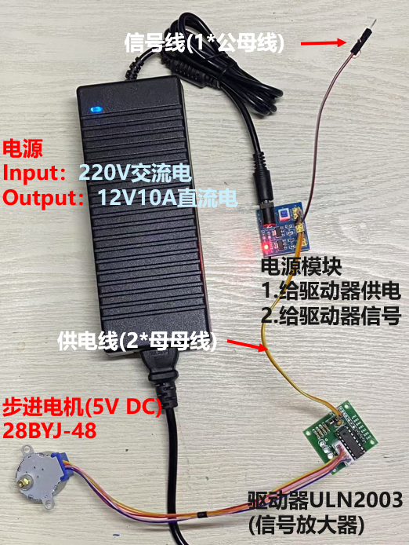
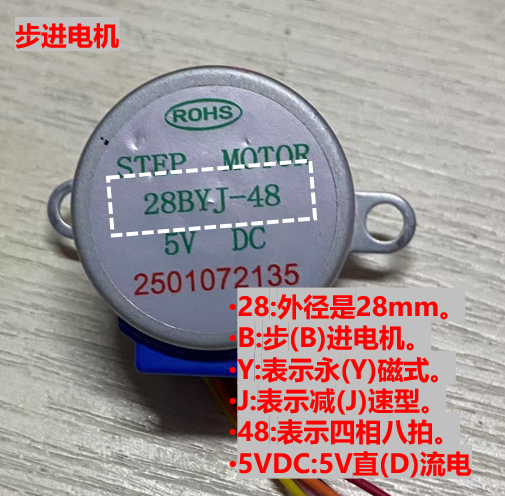
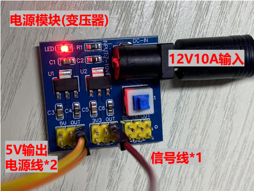
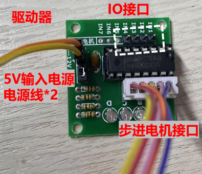
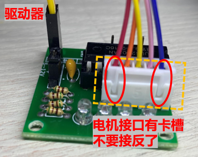

  
# 步进电机控制

 

* 如果你需要更多信息，请联系这个邮箱caiyijiehehe@gmail.com

* ## **手动控制步进电机**

  
  
<strong>总图</strong>

     

* ## **硬件要求**

* 控制步进电机需要4个硬件电源、电机、驱动器、控制器如下:
* 1个220V交流电转12V10A的电源（电源）
* 1个5V或者12V额定电压的28BYJ-48步进电机（电机）
* 1个ULN2003驱动板用于驱动电机（驱动器）
* 1个电源模块（电源）
* 1只手（控制器）

* ## **电机**

  
  
<strong>28BYJ-48步进电机(5V DC)</strong>

     

* ## **电源模块**

  
  
<strong>电源模块</strong>

     

5V输出的电源位置接2根 ‘母母线’ 用于给步进电机接线（不清楚需不需要区分正负，我是随便接的，我怀疑只影响旋转方向）

在3.3V位置接一根 ’公母线‘ ，一会用于拨动 驱动板 的 IO接口 的引脚

* ## **驱动板**

  
  
  
<strong>驱动板</strong>

     

电源线接到电源位置，板上标注5-12V的位置

步进电机5线对齐驱动板的接口，卡槽对其即可

信号线(之前提到的'公母线')的公头用于IO接口
 

* ## **视频演示**

暂无，可以直接下载01Chart文件夹中的mp4文件