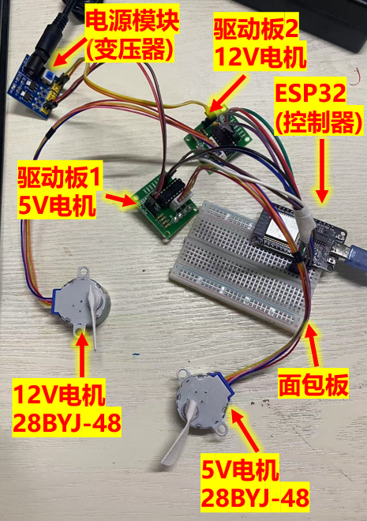
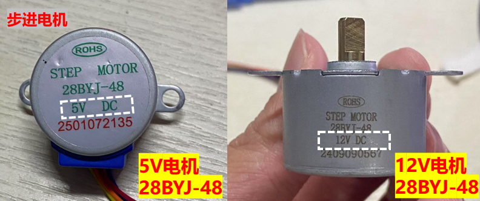
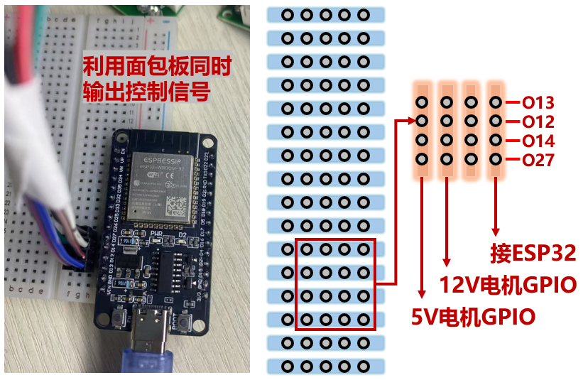

  
# 步进电机控制_03同步控制两个电机

 

* 如果你需要更多信息，请联系这个邮箱caiyijiehehe@gmail.com

* ## **同步控制2个步进电机**

  
  
<strong>总图</strong>

     

* ## **硬件要求**

* 控制步进电机需要4个硬件电源、电机、驱动器、控制器如下:
* 1个220V交流电转12V10A的电源（变压器，提供两种电压）
* 1个5V和1个12V额定电压的28BYJ-48步进电机（电机）
* 1个ULN2003驱动板用于驱动电机（驱动器）
* 1个电源模块（电源）
* 1个ESP32-WROOM-32（控制器）
* 1个面包板
* 若干个杜邦线（4个母母线，8个公母线）

* ## **电机**

  
  
<strong>28BYJ-48步进电机</strong>

     

* ## **电源模块**

  
  
<strong>电源模块</strong>

     

5V输出的电源位置接2根 ‘母母线’ 用于给5V步进电机接线

DC-IN的电源位置(12V)接2根 ’母母线‘ 用于给12V步进电机接线

* ## **面包板**

  
  
<strong>走线方式</strong>

     

ESP32的输出引脚的顺序为 13 12 14 27 （实物图中从下往上，解析图中从上往下）

按照引脚的顺序，连接2个驱动板的 IN1 IN2 IN3 IN4 （8跟公母线）

* ## **驱动板**

可以参考 'A_01Manual Control' 中的接线方式

* ## **视频演示**

暂无，可以直接下载00Chart文件夹中的mp4文件

 Arduino file【Click to expand】 

<pre><code>
# Edited by Yijie Cai! 

// 定义连接到28BYJ-48步进电机驱动板的GPIO引脚
`#define IN1 13`
`#define IN2 12`
`#define IN3 14`
`#define IN4 27`

`// 步进序列，用于驱动28BYJ-48`

`int step_Length = 8;`
`int steps[8] = {0b0001, 0b0011, 0b0010, 0b0110, 0b0100, 0b1100, 0b1000, 0b1001};  //8拍信号分配 5.625°一步 64步=45°`

`// 延迟时间，控制转动速度`
`int delayTime = 25 // 可以根据需要调整,最快的频率与拍数有关，实测结果为：最短延迟时间=8ms/拍数。因此旋转360°至少消耗4096ms`

`void setup() {`
`  // 设置引脚模式为输出`
`  pinMode(IN1, OUTPUT);`
`  pinMode(IN2, OUTPUT);`
`  pinMode(IN3, OUTPUT);`
`  pinMode(IN4, OUTPUT);`
`}`

`void loop() {`
`  // 让电机正转一圈`
`  for (int i = 0; i < 512; i++) { // 28BYJ-48大约需要64*8步转一圈 (每64步是45°，因此8*64=512步才能转360°)`
`    for (int step = 0; step < step_Length; step++) {  //步进电机需要给若干次指定顺序的信号才能旋转，信号次数等于拍数`
`      setStep(steps[step]); //给定信号`
`      delay(delayTime); //等待时间，最短延迟时间=8ms/拍数`
`    }`
`  }`

`//  delay(1000); // 等待5秒`

`  // 让电机反转一圈`
`  for (int i = 0; i < 512; i++) {`
`    for (int step = step_Length-1 ; step >= 0; step--) {`
`      setStep(steps[step]);`
`      delay(delayTime);`
`    }`
`  }`
`}`

`// 设置步进电机的状态`
`void setStep(int step) {`
`  digitalWrite(IN1, (step & 0b0001) > 0); //通过按位与的方式可以很巧妙的处理需要输出的信号`
`  digitalWrite(IN2, (step & 0b0010) > 0);`
`  digitalWrite(IN3, (step & 0b0100) > 0);`
`  digitalWrite(IN4, (step & 0b1000) > 0);`
`}`

</code></pre>

