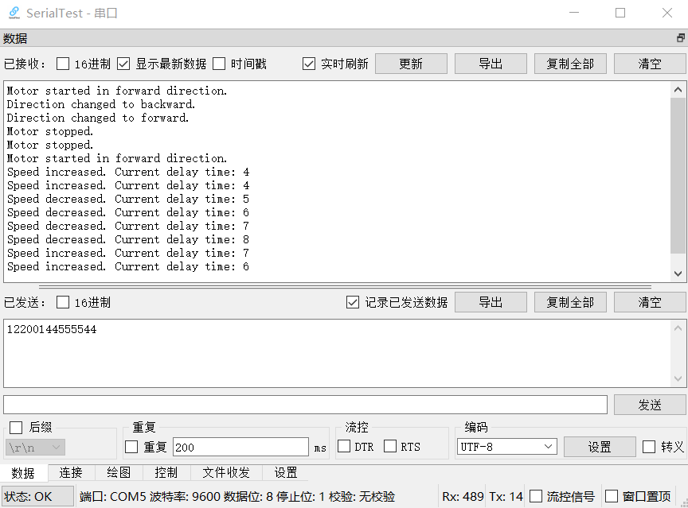

  
# 步进电机控制_04蓝牙控制电机

 

* 如果你需要更多信息，请联系这个邮箱caiyijiehehe@gmail.com

* ## **蓝牙控制电机旋转**

  
  
<strong>总图</strong>

     

* ## **硬件要求**

* 控制步进电机需要4个硬件电源、电机、驱动器、控制器如下:
* 1个220V交流电转12V10A的电源（电源）
* 1个5V和1个12V额定电压的28BYJ-48步进电机（电机）
* 1个ULN2003驱动板用于驱动电机（驱动器）
* 1个电源模块（变压器，提供两种电压）
* 1个ESP32-WROOM-32（控制器）
* 1个面包板
* 若干个杜邦线（4个母母线，8个公母线）
* 手机或者PC（用于蓝牙连接ESP32并输出信号）

* ## **接线方式**

接线方式可以参考 ['./B_Step_Motor/A_03Synchronous Control'](https://github.com/YijieCai/Motor/tree/main/B_Step_Motor/A_03Synchronous%20Control)

* ## **蓝牙串口调试工具**

非常感谢开源的[蓝牙串口调试工具](https://github.com/wh201906/SerialTest)

可以直接去这里[下载](https://github.com/wh201906/SerialTest/releases)

1.先在PC端连接ESP32

2.直接下载windows版本并解压，打开exe文件即可调试

3.'连接' 界面找到给ESP32输出信号的端口，我这边USB连接是COM3，蓝牙连接后多了两个，（COM4和COM5）

4.打开COM5，然后在 '数据' 界面输出信号 （我怀疑COM4是接受信号的？）

* ## **视频演示**

暂无，可以直接下载00Chart文件夹中的mp4文件

 Arduino file【Click to expand】 

<pre><code>
# Edited by Yijie Cai! 

    #include "BluetoothSerial.h"
    
    BluetoothSerial SerialBT;
    
    // 定义连接到28BYJ-48步进电机驱动板的GPIO引脚
    #define IN1 13
    #define IN2 12
    #define IN3 14
    #define IN4 27
    
    // 步进序列，用于驱动28BYJ-48
    int steps[8] = {0b0001, 0b0011, 0b0010, 0b0110, 0b0100, 0b1100, 0b1000, 0b1001};
    
    bool running = true; // 控制电机是否运行
    bool forward = true;  // 控制旋转方向
    int delayTime = 50;   // 初始延迟时间
    
    void setup() {
      // 设置引脚模式为输出
      pinMode(IN1, OUTPUT);
      pinMode(IN2, OUTPUT);
      pinMode(IN3, OUTPUT);
      pinMode(IN4, OUTPUT);
    
      // 初始化串行通信
      Serial.begin(9600);
      
      // 初始化蓝牙
      SerialBT.begin("ESP32_BT"); // 蓝牙设备名称
      Serial.println("The device started, now you can pair it!");
    }
    
    void loop() {
      if (SerialBT.available()) {
        char command = SerialBT.read();
        handleCommand(command);
      }
    
      if(running) {
        if(forward) {
          stepForwardSingleStep();
        } else {
          stepBackwardSingleStep();
        }
      } else {
        setStep(0); // 停止电机
      }
    }
    
    void handleCommand(int command) {
      switch(command) {
        case '0':
          running = false;
          SerialBT.println("Motor stopped.");
          break;
        case '1':
          running = true;
          forward = true;
          SerialBT.println("Motor started in forward direction.");
          break;
        case '2':
          forward = !forward;
          if(forward){
            SerialBT.println("Direction changed to forward.");
          } else {
            SerialBT.println("Direction changed to backward.");
          }
          break;
        case '3':
          SerialBT.println("Please enter the number of steps:");
          if(SerialBT.available()) {
            int stepsToMove = SerialBT.parseInt();
            moveSteps(stepsToMove);
          }
          break;
        case '4':
          if(delayTime > 4) delayTime--;
          SerialBT.print("Speed increased. Current delay time: ");
          SerialBT.println(delayTime);
          break;
        case '5':
          delayTime++;
          SerialBT.print("Speed decreased. Current delay time: ");
          SerialBT.println(delayTime);
          break;
      }
    }
    
    void moveSteps(int stepsToMove) {
      for (int i = 0; i < stepsToMove; i++) {
        if(forward) {
          stepForwardSingleStep();
        } else {
          stepBackwardSingleStep();
        }
      }
      running = false; // 移动指定步数后停止电机
    }
    
    void stepForwardSingleStep() {
      for (int step = 0; step < 8; step++) {
        setStep(steps[step]);
        delay(delayTime);
      }
    }
    
    void stepBackwardSingleStep() {
      for (int step = 7; step >= 0; step--) {
        setStep(steps[step]);
        delay(delayTime);
      }
    }
    
    void setStep(int step) {
      digitalWrite(IN1, (step & 0b0001) > 0);
      digitalWrite(IN2, (step & 0b0010) > 0);
      digitalWrite(IN3, (step & 0b0100) > 0);
      digitalWrite(IN4, (step & 0b1000) > 0);
    }

</code></pre>

