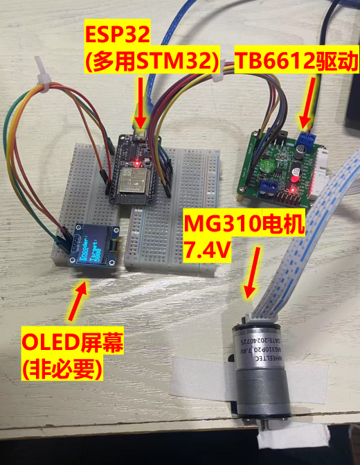
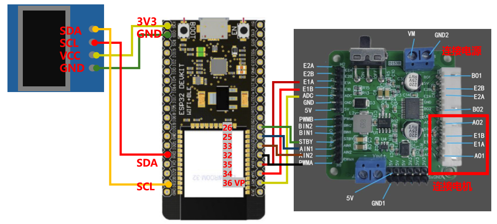

  
# 伺服电机控制_PID控制_旋转指定圈数

 

* 如果你需要更多信息，请联系这个邮箱caiyijiehehe@gmail.com

* ## **蓝牙控制电机旋转**

  
  
<strong>总图</strong>

     

* ## **硬件要求**

* 控制伺服电机需要4个硬件电源、电机、驱动器、控制器如下:
* 1个220V交流电转12V10A的电源（电源）
* 1个带霍尔传感器的7.4V的MG310伺服电机（电机）
* 1个TB6612驱动板用于驱动电机（驱动器-自带稳压模块）
* 1个ESP32-WROOM-32（控制器）
* 1个面包板
* 若干个杜邦线

* ## **接线方式**

  
  
<strong>接线图</strong>

 

## 左侧连接OLED屏幕的部分可有可无，方便调试

为了使用ESP32在OLED上显示内容，我们需要两个库Adafruit_SSD1306库和Adafruit_GFX库。
1. ESP32的SCL引脚(D22) - OLED的> SCL引脚
2. ESP32的SDA引脚(D21) - OLED的> SDA引脚
3. ESP32的3.3v引脚- OLED的> Vcc(支持3-5v)
4. ESP32的GND -> OLED的GND

## ESP32的右侧引脚连接TB6612驱动器

### PWMA
这是用来控制连接到A通道电机的速度控制引脚。通过向这个引脚发送PWM（脉冲宽度调制）信号，可以调节电机的速度。PWM信号的占空比决定了电机电压的有效值，从而影响电机的速度。

### AIN1 和 AIN2
这两个引脚是用来控制A通道电机的方向的。AIN1和AIN2的不同状态组合决定了电机的旋转方向：

当AIN1为高电平且AIN2为低电平时，电机将朝一个方向旋转。01: 顺时针

当AIN1为低电平且AIN2为高电平时，电机将朝相反方向旋转。10: 逆时针

如果两个都设置为相同电平（即同为高或同为低），则电机停止。00、11: 关闭

### STBY

这是一个待机/使能引脚。为了使TB6612正常工作，这个引脚需要被拉高（即接高电平）。

如果将STBY拉低，则进入待机模式，所有输出都将被禁用，这实际上是一种快速关闭电源的方法。

1: 开机

0: 关机

* ## **视频演示**

暂无，可以直接下载00Chart文件夹中的mp4文件

 Arduino file【Click to expand】 

<pre><code>
# Edited by Yijie Cai! 

    #include <Wire.h>
    #include <Arduino.h>
    #include <Adafruit_GFX.h>
    #include <Adafruit_SSD1306.h>
    
    
    //OLED Parameter
    
    #define SCREEN_WIDTH 128
    #define SCREEN_HEIGHT 64
    // URL: https://github.com/YijieCai/To-do-List-OLED/edit/main/01Arduino/TDL.ino
    Adafruit_SSD1306 display(SCREEN_WIDTH, SCREEN_HEIGHT, &Wire, -1);
    
    
    //Motor Parameter
    #define PWMA 32
    #define AIN1 25
    #define AIN2 33
    #define PWMB 12
    #define STBY 26
    #define E1A 34
    #define E1B 35
    #define Voltage 36 //使用模拟引脚
    
    int PwmA, PwmB;
    double V;
    double A1_Sign;
    double A2_Sign;
    int Vel_PWM;
    
    //PID Parameter
    volatile long encoderValue = 0; // 编码器计数值
    long targetPosition = 0; // 目标位置
    float kp = 1.0, ki = 0, kd = 0.15; // PID系数
    
    void setup() {
      // COM setup
      Serial.begin(115200);
    
      // OLED setup
      if(!display.begin(SSD1306_SWITCHCAPVCC, 0x3C)) { 
        Serial.println(F("SSD1306 allocation failed"));
        for(;;);
      }
      display.clearDisplay();
      display.setTextSize(2);
      display.setTextColor(SSD1306_WHITE);
      display.setCursor(0, 0);
      display.print("Motor");
      display.print(" Information");
      display.display();
    
    
    
      // Motor setup
      // 设置电机控制引脚为输出模式
      pinMode(PWMA, OUTPUT);
      pinMode(AIN1, OUTPUT);
      pinMode(AIN2, OUTPUT);
      pinMode(STBY, OUTPUT);
    
      // 设置编码器引脚为输入模式
      pinMode(Voltage,INPUT); //初始化作为输入端
      pinMode(E1A, INPUT);
      pinMode(E1B, INPUT);
    
      // 初始化编码器中断
      attachInterrupt(digitalPinToInterrupt(E1A), encoderISR, CHANGE);
      attachInterrupt(digitalPinToInterrupt(E1B), encoderISR, CHANGE);
    
      // 让电机驱动器退出待机模式
      digitalWrite(STBY, HIGH);
    }
    
    
    
    
    void loop() {
      // 假设我们想让电机转动到一个特定的目标位置
      if (Serial.available() > 0) {
        String inputString = Serial.readStringUntil('\n');
        targetPosition = inputString.toInt(); // 假设输入是整数形式的目标位置
        Serial.print("New Target Position: ");
        Serial.println(targetPosition);
      }
    
      
      // 实现PID控制
      float error = targetPosition - encoderValue;
      static float lastError = 0;
      static float integral = 0;
    
      integral += error;
      float derivative = error - lastError;
      lastError = error;
    
      float output = (kp * error) + (ki * integral) + (kd * derivative);
    
      // 根据PID输出调整PWM信号
      if(output > 0){
          analogWrite(PWMA, (int)min(abs(output), (float)100)); // 强制转换为int类型
          digitalWrite(AIN1, LOW);
          digitalWrite(AIN2, HIGH);
      } else {
          analogWrite(PWMA, (int)min(abs(output), (float)100)); // 强制转换为int类型
          digitalWrite(AIN1, HIGH);
          digitalWrite(AIN2, LOW);
      }
    
      // 打印当前状态到串口监视器
      Serial.print("Encoder:");
      Serial.print(encoderValue);
      Serial.print(" Target:");
      Serial.println(targetPosition);
    
    
      display.clearDisplay();
      display.setTextSize(2);
      display.setTextColor(SSD1306_WHITE);
      display.setCursor(0, 0);
    
      display.println("Encoder: ");  //对模拟量转换并通过串口输出
      display.println(encoderValue);
    
      display.println("Target: ");  //对模拟量转换并通过串口输出
      display.println(targetPosition);
      
      display.display();
    
      
      delay(10); // 简单的时间延迟来模拟PID循环
    }
    
    void encoderISR() {
      // 霍尔编码器中断服务程序，用于更新编码器值
      static int lastState = digitalRead(E1A);
      int currentState = digitalRead(E1A);
    
      if(currentState != lastState){
        if(digitalRead(E1B) != currentState){
          encoderValue++;
        } else {
          encoderValue--;
        }
      }
      lastState = currentState;
    }

</code></pre>

